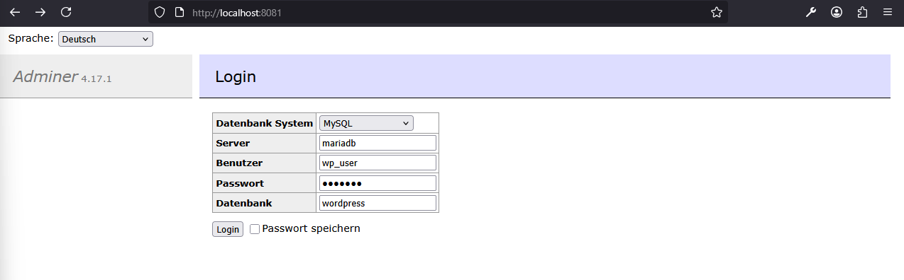
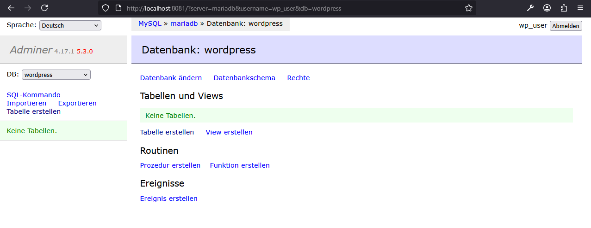

# WordPress

An Example for a simple `docker compose` setup. To start a Wordpress application with a database and browser access.

---

## Table of Content

- [WordPress](#wordpress)
  - [Table of Content](#table-of-content)
  - [Description](#description)
  - [Prerequisites](#prerequisites)
  - [Repository Structure](#repository-structure)
  - [Quickstart](#quickstart)
  - [Author](#author)

---

## Description

A simple demo showing how `docker compose` works with multiple services.

Services included:
```text
- WordPress	// Application
- Mariadb	// Database
- Adminer	// Database GUI
```
---

## Prerequisites

* [Docker](https://www.docker.com/) must be installed on your system
* [Git](https://git-scm.com/) must be installed on your system

---

## Repository Structure

```bash
wordpress_example/
├── docker-compose.yml                  # Docker container setup
├── img/                                # All Images (Screenshots)
├── .gitignore                          # Ignore rules for Git
├── README.md                           # Project overview and navigation
└── Wordpress_Checkliste.pdf            # Checklist
```

---

## Quickstart

1. Download the project:

```bash
git clone https://github.com/GeorgStrassberger/wordpress_example.git
```

2. Navigate into the project folder

```bash
cd ./wordpress_example
```

3. Pull Docker images and start the containers

```bash
docker compose up -d
```
* `docker compose`: container group
* `up`: Start all container
* `-d`: detached mode (runs in the background)

4. Open your browser to access WordPress on [http://localhost:8080](http://localhost:8080)


5. Open your browser to access Adminer on [http://localhost:8081](http://localhost:8081)

    

6. Adminer Login 
    ````text
    User-Login (normal User):
    System:         MySQL       //Databanktype
    Server:         mariadb     //Docker service name of the database container
    Username:       wp_user     //MYSQL_USER
    Password:       wp_pass     //MYSQL_PASSWORD
    Datenbank:      wordpress   //MYSQL_DATABASE
    ```` 

    ````text
    Root-Login (Administrator-Zugriff):
    System:         MySQL       //Databanktype
    Server:         mariadb     //Docker service name of the database container
    Username:       root        //MYSQL_USER
    Password:       root_pass   //MYSQL_ROOT_PASSWORD
    Datenbank:      (empty)     
    ```` 
  
    

6. Stop and remove the containers and volumes 

```bash
docker compose down -v
```
* `docker compose`: container group
* `down`: stop and remove all containers
* `-v`: also remove volumes (data)

---

## Author

```text

  ██████╗   ███████╗   ███████╗  █████████╗
 ██╔════╝   ██╔════╝  ██╔═════╝  ╚══██╔═══╝
 ██║  ███╗  █████╗    ╚█████╗       ██║
 ██║   ██║  ██╔══╝     ╚═══██╗      ██║
 ██║   ██║  ██║             ██╗     ██║
 ╚██████╔╝  ███████╗   ███████║     ██║
  ╚═════╝   ╚══════╝   ╚══════╝     ╚═╝
```

---
